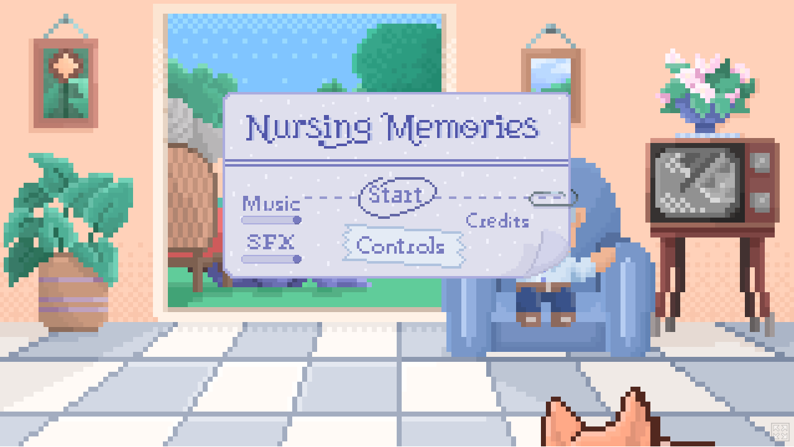

<h1 align="center">Hi 👋, I'm Benjamin!</h1>
<h3 align="center">A Full stack developer from Argentina</h3>

<h3 align="center">I am a lover of technology, video games and programming, with experience in teamwork styles such as SCRUM and full stack development using technologies such as JavaScript, React, PostgreSQL, Redux among others.</h3>

- 🔭 I’m currently working on [DiceStarte](https://github.com/Cocofexe/DiceStarter)

<h3 align="left">Languages and Tools:</h3>

                

## Some projects:

• PI - [Food](https://github.com/Xaldersoul/Food-app)

 

• Ecommerce - [DiceStarter](https://github.com/Cocofexe/DiceStarter)

 

 

• Videogame - [Nursing memories](https://eliosherb.itch.io/nursing-memories)

 

 

- 📫 How to reach me
- email: **benjamin.g.guerra@hotmail.com**
- Likedin: **https://www.linkedin.com/in/benjamin-guerra-dev/**
